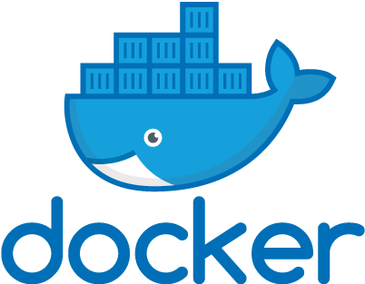

#  Bear matches: Pandas and Polars in Action


Pandas and Polars are two powerful Python libraries for data manipulation and analysis, and while they're similar in many ways, they also have some key differences:

- **Syntax/API**: Though many functions have similar names, there are differences in syntax and method names.
- **Performance**: Polars is built for high performance, often leveraging Rust's efficiency, resulting in faster execution times compared to Pandas.
- **Lazy Evaluation**: Polars supports lazy evaluation, offering more optimization opportunities during execution.

This repository features challenging assignments with solutions in both Pandas and Polars, aiming to compare their syntax and performance.

**Please note that the current repository is a work in progress and is  being updated with new assignments and solutions.**
## 1. Running your code with Docker


This section provides instructions for running the Python application using Docker and Docker Compose.  
The application is configured to run with Python 3.11 and includes dependencies listed in `requirements.txt`.

### 2.1 Prerequisites

* Docker installed on your system.
* Docker Compose installed on your system.

### 2.2 Building the Docker Image

To build the Docker image, run the following command:

```sh
docker-compose build
```

### 2.3 Running the container

To run the container in detached mode, use the following command:
```sh
docker-compose up -d
```
This will start the container with the src folder bind-mounted into the container.   
The application will run the main.py script located in the src folder.

### 2.4 Running custom python scripts

To run any Python script from the mounted src folder, you can use the `docker-compose exec` command.  
For example, to run example.py, use:
```sh
docker-compose exec bear_matches_app python /app/src/joins/pandas/movies_with_no_genres.py
```
Please note that the `bear_matches_app` is the service name is defined in the `docker-compose.yml` file.

### 2.5 Stopping the container

To stop the running container, use the following command:

```sh
docker-compose down
```

### 2.6 Rebuilding the image with new dependencies

If you need to add new Python packages, update the `requirements.txt` file and rebuild the Docker image with the following commands:

```sh
docker-compose build
docker-compose up -d
```
This will rebuild the image with the new dependencies and start the container in detached mode.

### 2.7 Summary

1. **Dockerfile**: Sets up a Python 3.11 environment, installs dependencies from `requirements.txt`, and sets 
    the command to keep the container running.
2. **docker-compose.yml**: Defines the service, mounts the `src` folder, and sets the command to run a Python script.
3. **README.md**: Provides detailed instructions on building, running, stopping, and managing the 
  Docker container, including handling new dependencies. 

With this setup, you can run the container in detached mode and easily execute any Python script from the `src` folder.


## 2. Resources

* [Official Pandas Documentation](https://pandas.pydata.org/docs/)  

* [Official Polars Documentation](https://docs.pola.rs/api/python/stable/reference/index.html)  
Check the [learning materials](docs/learning_materials.md) section of the repository for more resources on Pandas and Polars.


## 3. Suggestions and Feedback

I would love to hear your suggestions and feedback. Please feel free to reach out to me at   
[hi [at] peterfulop [dot] tech](mailto:hi@peterfulop.tech).